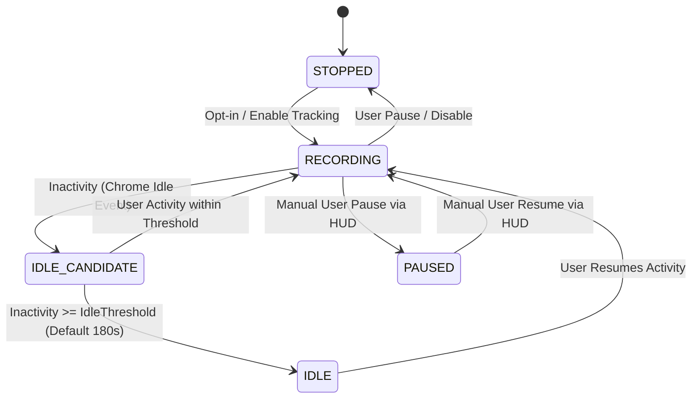

# ATLAS State Machine Specification
## Atentiv Tab Lifecycle and Activity-State System

### 1. Architectural Motivation
Prior browser productivity tools suffered from two fatal flaws:
1. **Premature Switching**: Registering task switches whenever page titles or semantic vectors fluctuated slightly within the same tab or during brief research detours.
2. **Idle Distortion**: Penalizing user inactivity as "distracting/unproductive time", thereby severely skewing productivity ratios during meetings, offline reading, or contemplation.

ATLAS solves this by decoupling low-level browser lifecycle events, ML classification, and high-level workstream discovery into an asynchronous, deterministic state machine.

---

### 2. State Machine Topology
ATLAS operates across 5 discrete lifecycle states:

### 3. State Definitions & Invariants

| State | Active Dwell Timer | Focus Score Penalty | Event Logging | Description |
| :--- | :---: | :---: | :---: | :--- |
| **`STOPPED`** | Frozen | None | Disabled | Tracking is globally disabled. Zero data captured. |
| **`RECORDING`** | Ticking (1s resolution) | Factored into active ratio | Enabled | Active browsing. Tab interactions, keystrokes, scroll events tracked. |
| **`IDLE_CANDIDATE`**| Ticking | None | Grace period buffer | User has stopped interacting for $< T_{idle}$ seconds. Dwell time continues. |
| **`IDLE`** | **Frozen** | **Zero Penalty** | Heartbeat only | Inactivity $\ge 180\text{s}$. Dwell time freezes. `idle_seconds` accumulated separately. |
| **`PAUSED`** | Frozen | None | Suspended | User explicitly paused session via floating HUD or Sidepanel. |

---

### 4. Workstream Hysteresis & Anti-Oscillation
To prevent workstream fragmentation (erratic switching between tasks), the Workstream Engine implements a dual-threshold hysteresis buffer:

$$S(A, W) = 0.35 \cdot \text{Sim}_{\text{semantic}} + 0.20 \cdot \text{Sim}_{\text{category}} + 0.15 \cdot \text{Sim}_{\text{activity}} + 0.10 \cdot \text{Sim}_{\text{domain}} + 0.10 \cdot \text{Sim}_{\text{temporal}} + 0.10 \cdot \text{Sim}_{\text{nav}}$$

- **Adoption Threshold ($\theta_{\text{enter}} = 0.70$)**: A new activity segment will only initiate a workstream transition if its multi-factor similarity score with the candidate stream $\ge 0.70$.
- **Retention Threshold ($\theta_{\text{keep}} = 0.55$)**: Once inside a workstream, the user remains associated with that workstream as long as similarity remains $\ge 0.55$.
- **Tentative Buffer ($N = 2$)**: An activity segment with borderline similarity is held in a tentative buffer. Only if two consecutive segments align with the new stream does the transition commit.

---

### 5. Verification & Testing
The ATLAS state machine is verified in `tests/unit/atlas.test.ts`:
- Verified transition from `RECORDING` to `IDLE_CANDIDATE` and `IDLE`.
- Verified active dwell timer freezing during idle states.
- Verified zero false context switches emitted when workstream reclassification occurs without a tab switch.
