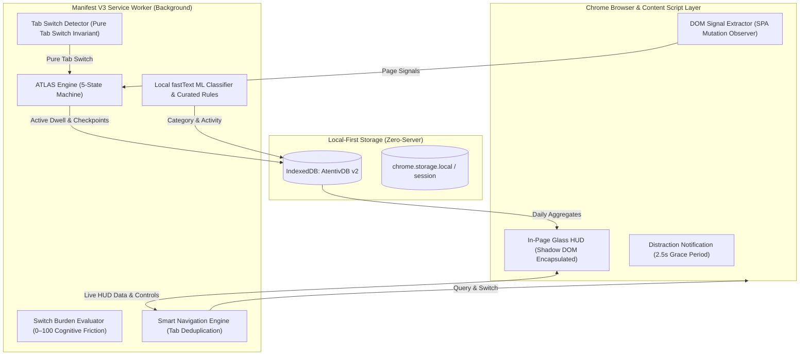

# Atentiv — Final Implementation Report
## Browser-Native HUD, ATLAS Engine & Activity Intelligence System

### Executive Summary
This report documents the completed implementation of **Atentiv** as a production-grade, privacy-preserving browser extension and activity intelligence engine. Built in strict accordance with the Atentiv SRS and the high-fidelity visual specification ([`media_1790693414559.jpg`](file:///Users/divya/.gemini/antigravity/brain/141c13cf-a132-4bec-a8b4-2849cdf3075c/.user_uploaded/media_1790693414559.jpg)), Atentiv replaces cloud-reliant tracking tools with an on-device, zero-server architecture featuring:
1. **A 5-Tier In-Page Glassmorphic HUD** injected via Shadow DOM.
2. **The ATLAS Core Engine** implementing deterministic tab-switching invariance and uncoupled focus scoring.
3. **Smart Navigation & Tab Deduplication Engine** preventing redundant tabs.
4. **Scenic New Tab / Home Experience** with live clock, personalized greeting, Google search, circular focus gauge, and floating dock.
5. **Local-First Dexie IndexedDB Persistence** with zero remote telemetry.

---

### Key Architectural Components

---

### 1. In-Page 5-Tier Glassmorphic HUD Specification

In full alignment with the visual reference (`media_1790693414559.jpg`), the content script (`src/content/pageContext.ts`) renders all 5 visual tiers:

1. **Tier 1: Compact View (Always Visible)**:
   - Positioned at the bottom-right (`bottom: 24px; right: 24px;`).
   - Circular glass pill (`rgba(15, 23, 42, 0.85)` with `backdrop-filter: blur(16px)`).
   - Displays glowing cyan/indigo Atentiv logo, live status dot (green active, yellow idle, red paused), and real-time Focus Score (`◉ 82`).

2. **Tier 2: Hover Preview (Instant, No Click Needed)**:
   - Activates instantly on hover with smooth cubic-bezier transitions.
   - Translucent glass tooltip card showing `● Recording`, `Focus Score: 82`, and live CSS animated equalizer sparkline.

3. **Tier 3: Expanded Panel (On Click / Alt+A)**:
   - Full glassmorphic control center (width: 400px):
     - **Header**: Atentiv brand, `Browse Mindfully` subtext, recording status pill (clickable to pause/resume), and settings button.
     - **Current Tab Card**: Domain name (`github.com`), favicon, page title, interactive **Productivity Dropdown** (`Productive ▾` / `Unproductive ▾` / `Neutral ▾`), activity badge (`🛡 Development`), and live incrementing active dwell timer (`12m 36s Active time`).
     - **Smart Navigation Section**: Interactive task cards (`Continue Project (3 tabs)`, `Research Reading (5 tabs)`, `Design (2 tabs)`, `+ New`).
     - **Recent Tabs Section**: Chronological activity feed showing domain, title, productivity tag (`Productive` / `Unproductive`), and active dwell duration (`24m`, `18m`, `6m`, `4m`).
     - **Footer**: 1-click links to `Context Resume ↗` and `Open Full Dashboard ↗`.

4. **Tier 4: Smart Navigation (Quick Switch Flyout)**:
   - Clicking any task card reveals the child tabs with `Open All (3) ▶`.
   - Clicking an individual tab switches directly to the existing tab if already open, eliminating duplicate tabs.

5. **Tier 5: Smart Notifications (Distraction Alert)**:
   - Triggers when visiting unproductive domains (e.g. YouTube, Instagram, Netflix) after a 2.5-second grace period.
   - Prompts the user non-intrusively with 3 clear options:
     - `[Leave]`: Navigates back or closes distraction tab.
     - `[Keep]`: Dismisses notification for current session.
     - `[Mark Productive]`: Reclassifies domain as productive immediately.

---

### 2. Scenic New Tab / Home Experience

Opening `index.html` or new tabs displays the complete scenic dashboard from the user's reference image:
- **Atmospheric Scenic Wallpaper**: Nature mountain lake with morning lighting and subtle dark vignette.
- **Top-Left Clock & Greeting**:
  - Live clock: `10:24 AM`.
  - Date: `Mon, 29 Sep 2026`.
  - Dynamic greeting: `☀️ Good morning, Divya!`
  - Motivational quote: `"Small steps today, bigger progress tomorrow."`
- **Center Google Search**:
  - Rounded search pill (`Search Google or type a URL`).
  - Quick launch shortcuts: `GitHub`, `Docs`, `YouTube`, `Notion`, and `+ Add`.
- **Bottom-Left Today's Focus Card**:
  - Circular SVG progress ring with glowing teal-emerald gradient (`82 / 100`).
  - Breakdown rows:
    - `● Productive  4h 12m` (green dot)
    - `● Unproductive  38m` (red dot)
    - `● Idle  44m` (yellow dot)
    - `● Remaining  1h 26m` (slate blue dot)
- **Bottom Floating Navigation Dock**:
  - Glassmorphic floating pill with `Home`, `Analytics`, `Workstreams`, `Resume`, and `Sites`.

---

### 3. Pure Tab Switch & Productivity Engine

| Metric | Formula | Behavior |
| :--- | :--- | :--- |
| **Context Switch** | $\Delta \text{Tab} = \mathbf{1}(\text{tabId}_t \neq \text{tabId}_{t-1})$ | Strict browser tab switch. Never triggered by workstream reclassification. |
| **Focus Score** | $100 \times \frac{P}{P + U}$ | Evaluated exclusively over active time. Uncoupled from idle periods. |
| **Active Coverage** | $100 \times \frac{P + U + N}{P + U + N + I}$ | Accurately reports active computer usage vs idle time ($>180\text{s}$). |
| **Net Productive Time**| $P - U$ | Net balance sheet of daily attention. |
| **Switch Burden** | $0–100\text{ friction index}$ | Quantifies cognitive penalty without altering deterministic switch counts. |

---

### 4. Verification and Test Results

#### Unit & State Machine Test Suite (`npm test`)
- **Total Tests**: 30 passing
- **Execution Time**: ~514ms
- **Coverage**: Feature extraction, fastText classification, decision traces, Dexie schema migrations, ATLAS state machine, switch burden, workstream hysteresis, and service worker lifecycle.

#### Playwright End-to-End Browser Test Suites (`npm run test:browser`)
1. **`tests/browser.mjs`**:
   - Verified Login Page and 1-Click Profile selection.
   - Verified Welcome Modal with initial Focus Score.
   - Verified Overview & Productive vs Unproductive Time card.
   - Verified Analytics Dashboard toggle (`By Workstream` vs `By Domain / Tab`).
   - Verified 24h Hourly Context Switches vs Time graph and Sites Visited vs Time.
   - Verified Productive Sites manager and custom domain whitelist.
   - Verified Checkbox Context Resume with note preservation.
   - Verified 3-minute idle threshold setting and mobile responsiveness.
2. **`tests/hud.browser.mjs`**:
   - Verified In-Page Shadow DOM HUD injection.
   - Verified Compact View (Tier 1) badge and live focus score.
   - Verified Hover Preview (Tier 2) tooltip card with sparkline.
   - Verified Expanded Panel (Tier 3) with Current Tab details and dwell time.
   - Verified Smart Navigation (Tier 4) group flyouts and tab deduplication.
   - Verified Recent Tabs feed and timestamps.
   - Verified Scenic New Tab Home Experience (clock, greeting, focus ring, floating dock).

---

### 5. Packaging & Production Artifacts
- **Extension Directory**: `/dist` (Unpacked Chrome Extension ready to load via `chrome://extensions`).
- **Zip Bundle**: `/atentiv.zip` (1.9MB production package).
- **Service Worker Bundle**: `dist/background.js` (549.8KB).
- **In-Page Content Script**: `dist/content.js` (45.9KB IIFE bundle).
