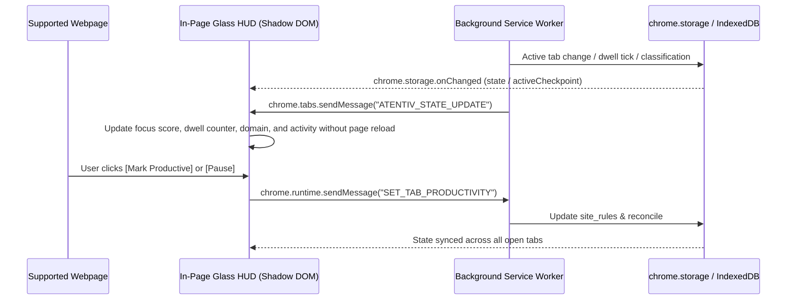

# Atentiv UI Architecture Specification
## Live Webpage HUD (Primary) vs. Side Panel (Secondary) vs. Dashboard

---

### 1. Architectural Philosophy: The Browser as an Intelligent Layer
Atentiv is strictly designed as an **in-page, floating browser HUD** that overlays supported webpages without replacing or resizing them. The user browses the web normally (visiting Google, GitHub, Wikipedia, StackOverflow, YouTube, Docs, etc.), while Atentiv quietly observes activity and renders a transparent, ambient layer on top.

```
┌────────────────────────────────────────────────────────────────────────┐
│ Chrome Tabs / Omnibox                                                  │
├────────────────────────────────────────────────────────────────────────┤
│                                                                        │
│                      ACTUAL USER WEBPAGE                               │
│                                                                        │
│   (Webpage remains 100% visible, scrollable, and fully functional)     │
│                                                                        │
│                                           ┌────────────────────────┐   │
│                                           │  Atentiv Glass HUD     │   │
│                                           │  10:24 AM · Mon, 29 Sep│   │
│                                           │  ● Recording           │   │
│                                           │  Focus Score 82        │   │
│                                           │  github.com · Coding   │   │
│                                           │  Smart Navigation      │   │
│                                           └────────────────────────┘   │
│                                           ┌───────────┐                │
│                                           │ ◉ 82 10:24│                │
│                                           └───────────┘                │
│                                           (Compact Pill)               │
└────────────────────────────────────────────────────────────────────────┘
```

---

### 2. The Three UI Surfaces

Atentiv divides user experience across three clearly separated surfaces:

| Surface | Presentation Mode | Role | Technology |
| :--- | :--- | :--- | :--- |
| **Surface A: Live Page HUD** | Injected directly on top of HTTP/HTTPS web pages | **Primary Experience** (Ambient, Continuous, Instant) | Content Script (`src/content/pageContext.ts`), Shadow DOM, Glassmorphic CSS |
| **Surface B: Chrome Side Panel** | Docked alongside the browser viewport | **Secondary Experience** (Deep Analytics, Rule Management) | Chrome Side Panel API (`index.html?mode=sidepanel`), React 19 |
| **Surface C: Full Dashboard** | Dedicated tab or options page | **Administrative & Audit** (Historical Exports, ML Traces) | Standalone extension page (`index.html`), Dexie IndexedDB |

---

### 3. Surface A: In-Page Live HUD (Primary Experience)

#### 3.1 Non-Intrusive Overlay & Pointer-Events Architecture
The HUD must never cause website layout shift, page reflow, or click interception:
```css
/* Host element covers viewport without blocking webpage clicks */
#atentiv-sidebar-container {
  all: initial;
  position: fixed;
  inset: 0;
  pointer-events: none;
  z-index: 2147483647;
}

/* Only interactive HUD components intercept pointer events */
#atentiv-compact-btn,
#atentiv-badge,
#atentiv-hover-card,
#atentiv-expanded-panel,
#atentiv-distraction-toast {
  pointer-events: auto;
}
```
- **Webpage Underneath**: Stays completely clickable, scrollable, and responsive. Clicks anywhere outside the active HUD cards pass directly through to the underlying website.
- **Backdrop Catcher**: An invisible catcher is activated only while the expanded panel is open to cleanly catch outside clicks and collapse the HUD back to compact mode.

#### 3.2 Shadow DOM Style Isolation
The HUD is rendered inside an `open` Shadow Root:
- No website CSS (Tailwind, Bootstrap, reset stylesheets) can leak into Atentiv or alter its fonts, borders, or colors.
- Atentiv styles are strictly scoped and cannot break host website elements.

#### 3.3 Visual Glassmorphism
- Translucent dark glass: `background: rgba(10, 18, 32, 0.65)` with `backdrop-filter: blur(20px)`.
- The real webpage text, code, or images remain visible through the HUD.
- High-contrast typography guarantees legibility over light and dark websites alike.

#### 3.4 5-Tier Interaction Topology
1. **Tier 1 (Compact Pill)**: Bottom-right (or user-chosen corner) minimal pill displaying the glowing Atentiv mark, live recording indicator dot, Focus Score (`◉ 82`), and live Clock (`10:24 AM`).
2. **Tier 2 (Hover Preview)**: Instant tooltip card popping out on hover showing `● Recording`, `• Focus Score: 82`, current domain, activity, and equalizer sparkline.
3. **Tier 3 (Expanded Panel)**:
   - Header with prominent Clock widget (`10:24 AM · Mon, 29 Sep`), Atentiv branding, recording status toggle, corner reposition button (`⤢`), sidepanel button (`⚙`), and close button (`✕`).
   - Current Tab Card with favicon, domain, page title, interactive **Productivity Dropdown** (`Productive ▾` / `Unproductive ▾` / `Neutral ▾`), activity badge (`🛡 Development`), and active dwell timer (`12m 36s Active time`).
   - Smart Navigation task cards with child tab flyout, 1-click tab switching, and duplicate tab prevention.
   - Recent Tabs chronological feed with dwell durations.
   - Multitasking summary: Focus score, pure tab switches count, idle time, active coverage.
4. **Tier 4 (Smart Navigation Flyout)**: Tab list with instant switching; checks existing open tabs before opening to avoid duplicates.
5. **Tier 5 (Distraction Notification)**: Non-blocking warning on unproductive domains after 2.5s grace period with `[Leave]`, `[Keep Browsing]`, and `[Mark Productive]`.

#### 3.5 Position Repositioning & Persistence
- Supports 4 screen corners: `bottom-right` (default), `bottom-left`, `top-right`, and `top-left`.
- Clicking the reposition button (`⤢`) cycles corners smoothly.
- Position is persisted in `chrome.storage.local` (`atentiv_hud_position`), maintaining the user's preference across all visited websites.

---

### 4. Surface B: Chrome Side Panel (Secondary Surface)

The Chrome Side Panel is reserved as a **secondary, deep analytical workspace**:
- **When Accessed**: When the user clicks the Atentiv toolbar action icon, clicks `⚙` in the HUD header, or clicks `Open Side Panel ↗` in the HUD footer.
- **Capabilities**:
  - Full hourly context switch bar graphs (`Context Switches vs Time`).
  - Interactive "Where did my time go?" donut charts toggled between `By Workstream` and `By Domain / Tab`.
  - Comprehensive Productive vs Unproductive Sites Whitelist & Blacklist manager.
  - Workstream clustering graph and rule editor.
  - Checkbox Context Resume snapshot manager and tab restore engine.
  - Privacy exclusion editor, 3-minute idle threshold slider, and raw JSON export/wipe.

The user never needs to open the Side Panel just to check their time, focus score, or recording status—those are continuously available on the live webpage HUD.

---

### 5. Live State Synchronization Bus



This reactive architecture ensures that browsing across Google, GitHub, StackOverflow, or YouTube updates the in-page HUD in real-time with sub-millisecond overhead and zero layout disruption.
