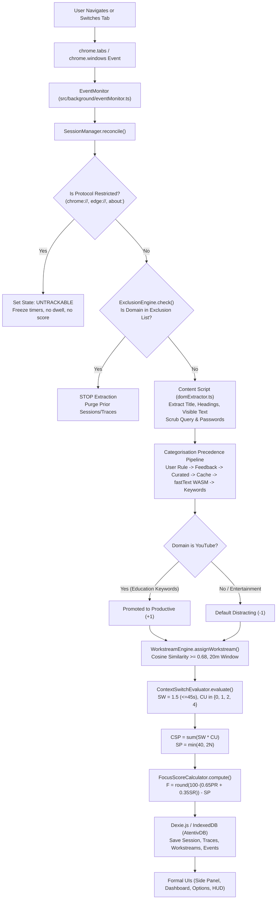
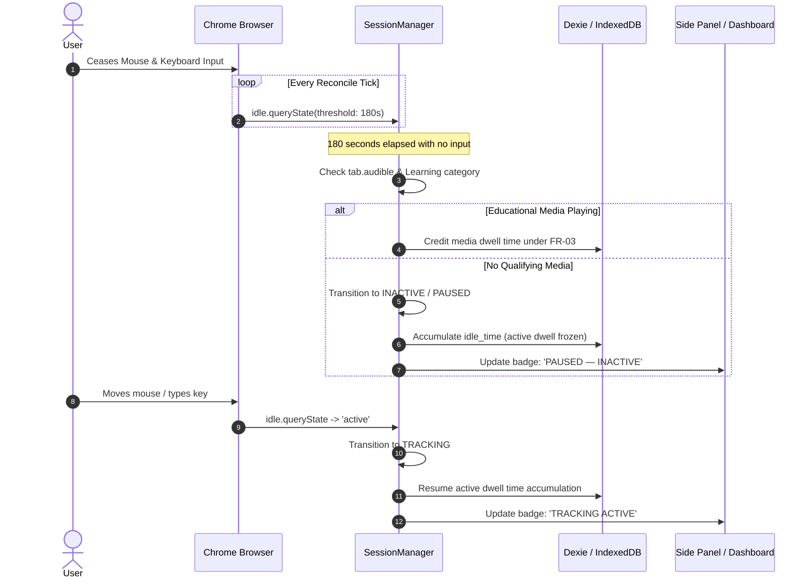
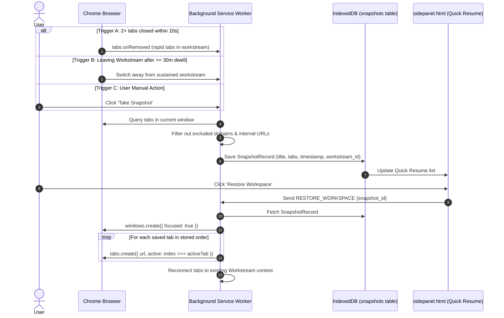
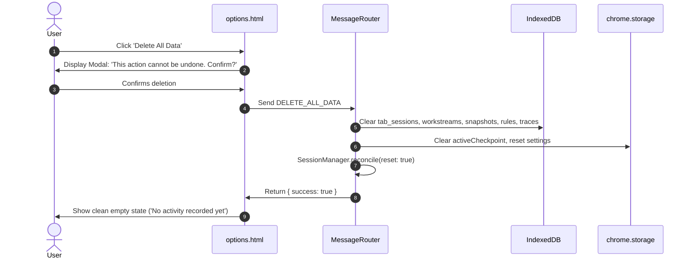

# Atentiv — System Data Flow Architecture
**Authority:** Latest Atentiv SRS Revision 3.1 / Submission Version 3.0  
**Status:** Canonical End-to-End Flow  

---

## 1. End-to-End Browsing Activity Data Flow

---

## 2. Inactivity & Sleep Data Flow

---

## 3. Snapshot Save & Restore Data Flow

---

## 4. Privacy & Data Deletion Data Flow

