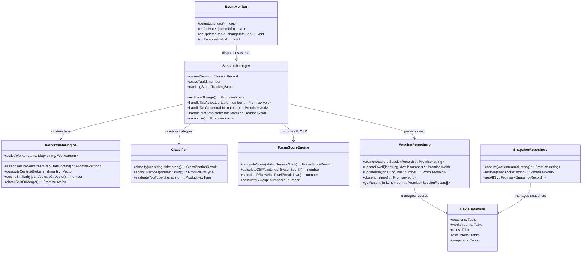

# Atentiv — Class & Domain Model Diagram
**Specification Baseline:** SRS Revision 3.1 / Submission Version 3.0

```mermaid
classDiagram
    class SessionManager {
        +currentSession: SessionRecord
        +activeTabId: number
        +trackingState: TrackingState
        +initFromStorage(): Promise~void~
        +handleTabActivated(tabId: number): Promise~void~
        +handleTabClosed(tabId: number): Promise~void~
        +handleIdleState(state: IdleState): Promise~void~
        +reconcile(): Promise~void~
    }

    class EventMonitor {
        +setupListeners(): void
        +onActivated(activeInfo): void
        +onUpdated(tabId, changeInfo, tab): void
        +onRemoved(tabId): void
    }

    class WorkstreamEngine {
        +activeWorkstreams: Map~string, Workstream~
        +assignTabToWorkstream(tab: TabContext): Promise~string~
        +computeCentroid(tokens: string[]): Vector
        +cosineSimilarity(v1: Vector, v2: Vector): number
        +checkSplitOrMerge(): Promise~void~
    }

    class Classifier {
        +classify(url: string, title: string): ClassificationResult
        +applyOverrides(domain: string): ProductivityType
        +evaluateYouTube(title: string): ProductivityType
    }

    class FocusScoreEngine {
        +computeScore(stats: SessionStats): FocusScoreResult
        +calculateCSP(switches: SwitchEvent[]): number
        +calculatePR(dwells: DwellBreakdown): number
        +calculateSR(csp: number): number
    }

    class SessionRepository {
        +create(session: SessionRecord): Promise~string~
        +updateDwell(id: string, dwell: number): Promise~void~
        +updateIdle(id: string, idle: number): Promise~void~
        +close(id: string): Promise~void~
        +getRecent(limit: number): Promise~SessionRecord[]~
    }

    class SnapshotRepository {
        +capture(workstreamId: string): Promise~string~
        +restore(snapshotId: string): Promise~void~
        +getAll(): Promise~SnapshotRecord[]~
    }

    class DexieDatabase {
        +sessions: Table
        +workstreams: Table
        +rules: Table
        +exclusions: Table
        +snapshots: Table
    }

    EventMonitor --> SessionManager : dispatches events
    SessionManager --> WorkstreamEngine : clusters tabs
    SessionManager --> Classifier : resolves category
    SessionManager --> SessionRepository : persists dwell
    SessionManager --> FocusScoreEngine : computes F, CSP
    SessionRepository --> DexieDatabase : manages records
    SnapshotRepository --> DexieDatabase : manages snapshots
```
