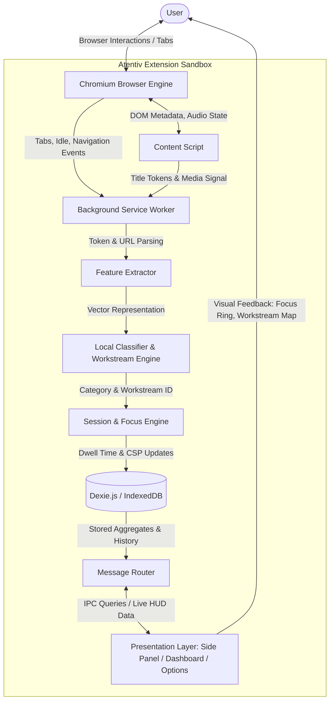

# Atentiv — Data Flow Diagram (DFD Level 0 & Level 1)
**Specification Baseline:** SRS Revision 3.1 / Submission Version 3.0

```mermaid
flowchart TD
    User([User]) <-->|Browser Interactions / Tabs| Chromium[Chromium Browser Engine]
    
    subgraph Atentiv Extension Sandbox
        Chromium -->|Tabs, Idle, Navigation Events| SW[Background Service Worker]
        Chromium <-->|DOM Metadata, Audio State| CS[Content Script]
        CS -->|Title Tokens & Media Signal| SW
        
        SW -->|Token & URL Parsing| FE[Feature Extractor]
        FE -->|Vector Representation| ML[Local Classifier & Workstream Engine]
        
        ML -->|Category & Workstream ID| SE[Session & Focus Engine]
        SE -->|Dwell Time & CSP Updates| IDB[(Dexie.js / IndexedDB)]
        
        IDB -->|Stored Aggregates & History| MR[Message Router]
        MR <-->|IPC Queries / Live HUD Data| UI[Presentation Layer: Side Panel / Dashboard / Options]
    end

    UI -->|Visual Feedback: Focus Ring, Workstream Map| User
```
