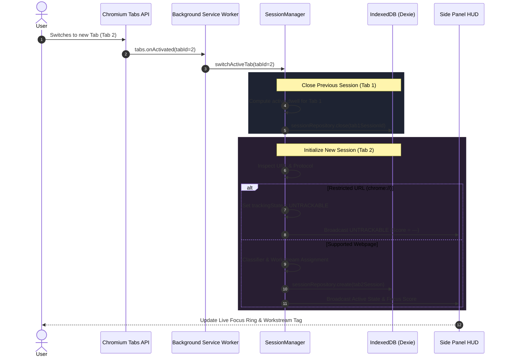

# Atentiv — System Sequence Diagrams
**Specification Baseline:** SRS Revision 3.1 / Submission Version 3.0

### Tab Activation & Dwell Calculation Sequence

```mermaid
sequenceDiagram
    autonumber
    actor User
    participant Browser as Chromium Tabs API
    participant SW as Background Service Worker
    participant Engine as SessionManager
    participant DB as IndexedDB (Dexie)
    participant UI as Side Panel HUD

    User->>Browser: Switches to new Tab (Tab 2)
    Browser->>SW: tabs.onActivated(tabId=2)
    SW->>Engine: switchActiveTab(tabId=2)
    
    rect rgb(30, 35, 50)
        Note over Engine,DB: Close Previous Session (Tab 1)
        Engine->>Engine: Compute active dwell for Tab 1
        Engine->>DB: sessionRepository.close(tab1SessionId)
    end
    
    rect rgb(40, 30, 50)
        Note over Engine,DB: Initialize New Session (Tab 2)
        Engine->>Engine: Inspect URL & Protocol
        alt Restricted URL (chrome://)
            Engine->>Engine: Set trackingState = UNTRACKABLE
            Engine->>UI: Broadcast UNTRACKABLE (Score = —)
        else Supported Webpage
            Engine->>Engine: Classifier & Workstream Assignment
            Engine->>DB: sessionRepository.create(tab2Session)
            Engine->>UI: Broadcast Active State & Focus Score
        end
    end
    
    UI-->>User: Update Live Focus Ring & Workstream Tag
```
