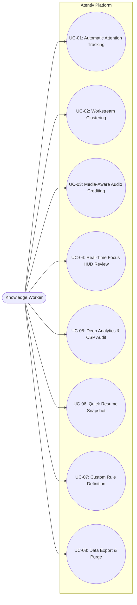

# Atentiv — Formal Use Case Models
**Specification Baseline:** SRS Revision 3.1 / Submission Version 3.0

```mermaid
flowchart LR
    User([Knowledge Worker])
    
    subgraph Atentiv Platform
        UC1((UC-01: Automatic Attention Tracking))
        UC2((UC-02: Workstream Clustering))
        UC3((UC-03: Media-Aware Audio Crediting))
        UC4((UC-04: Real-Time Focus HUD Review))
        UC5((UC-05: Deep Analytics & CSP Audit))
        UC6((UC-06: Quick Resume Snapshot))
        UC7((UC-07: Custom Rule Definition))
        UC8((UC-08: Data Export & Purge))
    end
    
    User --> UC1
    User --> UC2
    User --> UC3
    User --> UC4
    User --> UC5
    User --> UC6
    User --> UC7
    User --> UC8
```
